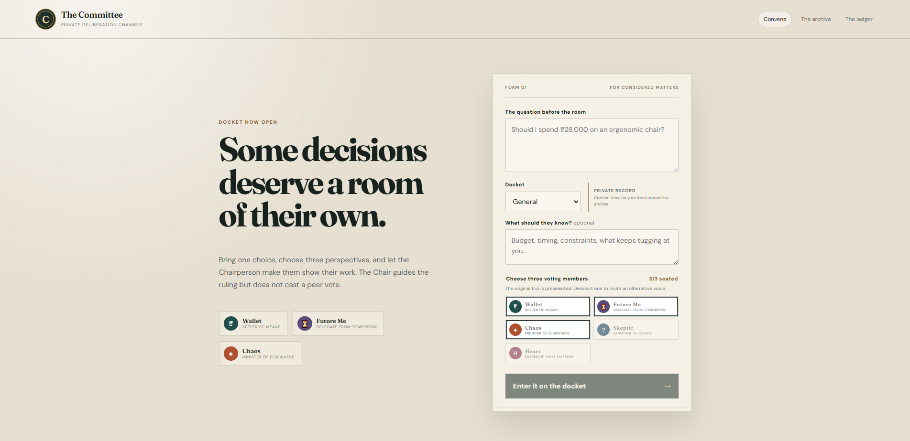
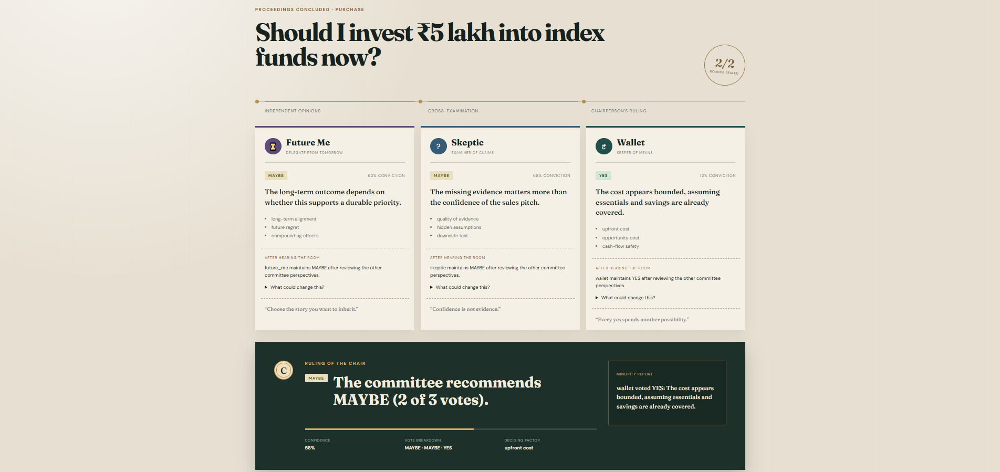

# The Committee

The Committee is a personal decision application in which three distinct committee members
evaluate a choice and a Chairperson synthesizes their evidence into a structured verdict.

The default voting committee is Wallet, Future Me, and Chaos. At intake, users can replace seats
with Skeptic (evidence and assumptions) or Heart (values and relationships). The Chairperson is a
non-voting synthesis role, so each decision still has three peer votes.

<p align="center">
  
  
</p>

## Backend development

The backend requires Python 3.12 or newer.

```powershell
python -m venv .venv
.\.venv\Scripts\python.exe -m pip install -e ".[dev]"
.\.venv\Scripts\alembic.exe upgrade head
.\.venv\Scripts\uvicorn.exe the_committee.api:app --reload
```

The API exposes:

* `GET /health`
* `POST /decisions`
* `POST /decisions/{decision_id}/deliberate`
* `GET /decisions/{decision_id}`

Run the M1 validation gate with:

```powershell
.\.venv\Scripts\python.exe -m pytest
.\.venv\Scripts\ruff.exe check .
.\.venv\Scripts\mypy.exe .
```

The application service owns orchestration. Domain models do not import persistence or HTTP
types, and committee members are injected through a typed protocol so deterministic and later
model-backed implementations can share the same boundary.

## Frontend development

The deliberation-room UI requires Node.js 22 or newer.

```powershell
cd frontend
npm install
npm run dev
```

Set `VITE_API_URL` when the API is not available at `http://localhost:8000`. The backend accepts
local Vite origins by default; production deployments must set `COMMITTEE_CORS_ORIGINS` to an
explicit comma-separated allowlist.

Validate the frontend with `npm run lint`, `npm run type-check`, `npm run test`, and
`npm run build`.

## Model provider configuration

Deterministic mode is the default and requires no external service. M2 also provides a strict
structured provider contract and deterministic mock provider. Configuration is read from:

* `COMMITTEE_PROVIDER_MODE` (`deterministic` or `mock`)
* `COMMITTEE_PROVIDER_NAME`
* `COMMITTEE_MODEL_NAME`
* `COMMITTEE_MODEL_TIMEOUT_SECONDS`
* `COMMITTEE_MODEL_MAX_ATTEMPTS`
* `COMMITTEE_MODEL_RETRY_BASE_DELAY_SECONDS`

## Remote Wallet (A2A)

Wallet can run as an independent A2A 1.0 agent:

```powershell
.\.venv\Scripts\uvicorn.exe the_committee.a2a_wallet:app --port 8001
$env:COMMITTEE_WALLET_A2A_URL = "http://127.0.0.1:8001"
.\.venv\Scripts\uvicorn.exe the_committee.api:create_app --factory --port 8000
```

See [`docs/A2A.md`](docs/A2A.md) for protocol, task lifecycle, fallback, and deployment details.
